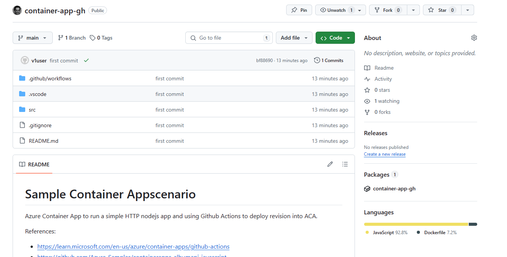

# Sample Container App scenario

Azure Container App to run a simple HTTP nodejs app and using Github Actions to deploy revision into ACA.

References:
- https://learn.microsoft.com/en-us/azure/container-apps/github-actions
- https://github.com/Azure-Samples/containerapps-albumapi-javascript


The action supports the following scenarios:
- Build from a Dockerfile and deploy to Container Apps
- Build from source code without a Dockerfile and deploy to Container Apps. Supported languages include .NET, Java, Node.js, PHP, and Python
- Deploy an existing container image to Container Apps


## Run and test it locally

Using npm:

```bash	
cd src
npm run start
```

Or using Docker:

```bash
cd src
docker build -t albumapi .
docker run -p 8080:8080 albumapi
```

Test in your bwoser with http://localhost:8080/albums

Or using curl:

```bash
curl -X GET -H "Content-Type: application/json" http://localhost:8080/albums
```

## Prepare it first for GitHub Actions

Before you will be able to run GitHub Actions to deploy Container Apps, you need to have the following:
- A GitHub repository with the source code of your app
- An Azure service principal and the credentials for authentication with Azure. It will be used by GitHub Actions to deploy the Container Apps
- A secret in the GitHub repository to store the Azure service principal credentials
- An Azure Resource Group where to deploy Container Apps
- An Azure Container Registry to store the container images of the Container Apps

**Create Azure infra resources**

The following script creates a new Service Principal, a new Resource Group and a Container Registry for container images. The new Resource Group will be used to deploy the Container Registry resource as well as the Container Apps.

You can edit the variables inside the script to customize the names of the resources being created.

```bash
./scripts/create-infra.sh
```

This command will output a file `auth.json` with the service principal credentials that will be used later for the Github Secrets.

**Create the GitHub repository**

Create the repository first.



In the GitHub repository, go to Settings > Security > Secrets and create a new secret with the name `AZURE_CREDENTIALS` and the content of the `auth.json` file.


Commit and push everything to the new respository. Push will trigger the action build-and-push.yaml that will build and push the container image to ghcr.io as well as deploy a new container App to Azure.
